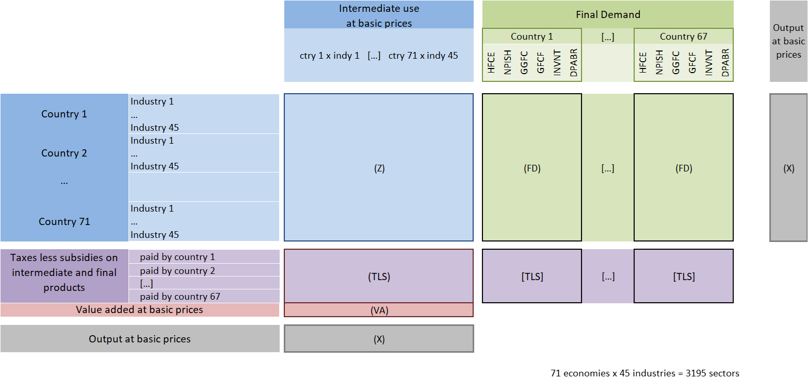

# iopy

## Description

This repository contains Python codes to easily load inter-country input-output data and give access to convenient attributes and methods 
to deal with these data, for example to run demand or supply shocks using Leontief or Ghosh models. 
Baldwin, Freeman & Theodorakopoulos (2022) is recommended as an introduction to input-output tables 
and Miller & Blair (2022) is recommended for background on the theory, but the basics are explained below.

Currently the following databases are supported:
- [OECD](http://oe.cd/icio)
- [Figaro](https://ec.europa.eu/eurostat/web/esa-supply-use-input-tables/figaro)
- [ExioBase](https://www.exiobase.eu/)

## Installation
```bash
pip install git+https://github.com/WWakker/iopy.git
```

## Structure of input-output data

Input-data model the economy in matrix form. Here, we explain input-output data using OECD data as an example.
THE OECD input-output tables contain inputs and outputs in current million USD for 45 sectors and 66 countries as well 
as rest-of-world. China and Mexico data are split into CN1, CN2, MX1, and MX2.


*source*: OECD

**Z** contains the intermediate inputs and outputs between industries. Rows represent outputs and 
columns represent inputs. Of course, not all outputs serve as input for other industries, as some products are final 
products for household consumption, government investment etc. These products are represented in final demand (**FD**) at 
country and category level, where the categories are Household Final Consumption Expenditure; Non-Profit Institutions Serving 
Households; General Government Final Consumption; Gross Fixed Capital Formation; Changes in Inventories and Valuables; 
Direct purchases abroad by residents.

The sum of intermediate outputs and final demand is equal to the total country-sector output, which also is equal to total 
country-sector input (**X**). The difference between intermediate inputs and total inputs is gross value added, which is split 
up into taxes less subsidies (**TLS**) and net value added (**V**).

## Theory

### Leontief model

Let 

```math
x = \begin{bmatrix} 
x_{1}\\ \vdots\\ x_{n} 
\end{bmatrix},\:
Z = \begin{bmatrix}
z_{11} & \dots & z_{1n}\\
\vdots & \ddots & \vdots\\
z_{n1} & \dots & z_{nn}\\
\end{bmatrix},\: 
f = \begin{bmatrix} 
f_{1}\\ \vdots\\ f_{n} 
\end{bmatrix}
```

where **x** is a column vector representing total output with the total output of each sector, **Z** is a matrix of 
intermediate use of inputs, with columns (*j*) representing inputs and rows (*i*) representing outputs, and **f** is a 
column vector representing final demand for each sector. Total output equals the sum of intermediate output (*Zi*, where
*i* is a column vector of 1's) and final demand as 

```math
\begin{equation} 
x = Zi + f
\end{equation} 
```

We define a matrix A by dividing each column in Z by the total input, such that $a_{ij} = z_{ij}/x_{j}$, as

```math
\begin{equation} 
A = Z\hat{x}^{-1}
\end{equation} 
```

Each entry in **A** represents the share of sector *j*'s input that comes from sector *i*, which is needed to produce a unit of sector *j*'s output. These coefficients are called technical coefficients. Combining (1) and (2), and given that sector inputs are equal to sector outputs, output can be represented as

```math
\begin{equation} 
x = Ax + f
\end{equation} 
```

It follows that 

```math
f = x - Ax = (I - A)x \Rightarrow x = (I - A)^{-1}f
```

Here, $(I - A)^{-1}$ is the so-called Leontief inverse **L**, so the equation can be written as

```math
\begin{equation} 
x = Lf
\end{equation} 
```

This is the Leontief equation, which defines the relation between output and final demand, and can be used to assess how output changes in each sector following a change in demand in specified sectors. The equation can be specified in levels as in (4), or in differences as

```math
\begin{equation} 
\Delta x = L \Delta f
\end{equation} 
```

### Ghosh model

Where Leontief relates sectoral outputs to the amount of final product, or products leaving the system, 
Ghosh (1958) relates sectoral production to the primary inputs $v'$, or value entering the system. Instead of (1), 
output is then expressed as

```math
\begin{equation} 
x' = i'Z + v'
\end{equation} 
```

where v' is the primary inputs or value added.

In the demand side equation, **A** is obtained by dividing each column entry by the total output of that sector. For Ghosh's supply side equation, **B** is obtained by dividing each row entry by the total sector output. Instead of technical coefficients these are called allocation coefficients, which represent the shares of sector *i*'s output and their distribution across sectors *j*.

```math
\begin{equation} 
B = \hat{x}^{-1} Z
\end{equation} 
```

In a similar fashion as done above

```math
\begin{equation} 
x' = x'B + v'
\end{equation} 
```

then

```math
v' = x' - x'B = (I - B)x' \Rightarrow x' = v'(I - B)^{-1}
```

Similarly, $(I - B)^{-1}$ is called the Ghosh inverse **G**, so the equation can be written as

```math
\begin{equation} 
x' = v'G
\end{equation} 
```

This is equivalent to 

```math
\begin{equation} 
x = G'v
\end{equation} 
```

which can also be written in changes as

```math
\begin{equation} 
\Delta x = G' \Delta v
\end{equation} 
```

This is the Ghosh equation, which defines the relation between production output and primary inputs or value added.

## How to use

### Create an instance of the OECD class

Creating an instance of the OECD class loads the OECD data and gives access to convenient attributes and methods. 
An instance can be create as follows, specifiying a year between 1995 and 2018.

```python
import iopy 
oecd = iopy.OECD(version='2021', year=2018, refresh=False)
```

Similary, an instance can be created for other data, for example Figaro and ExioBase as

```python
import iopy 
figaro = iopy.Figaro(version='2022', year=2020, kind='industry-by-industry')
exio = iopy.ExioBase(version='3.81', year=2022, kind='industry-by-industry')
```

Creating an instance of a database class downloads and loads the data into memory, creates standard input-output matrices, and gives access to the following attributes and methods:

| Attribute or method | Description |
| --- | --- |
| `version` | Specified version |
| `year` | Specified year |
| `df`   | Raw input-output data as pandas dataframe |
| `regions`   | List of regions |
| `sectors`   | List of sectors |
| `unit` | Unit of datapoints |
| `rs`   | `len(regions)` * `len(sectors)` |
| `Z`   | Intermediate use |
| `V`   | Gross value added |
| `FD`   | Final demand |
| `X`   | Output |
| `A`   | Technical coefficients |
| `L`   | Leontief inverse |
| `B`   | Allocation coefficients |
| `G`   | Ghosh inverse |
| `FD_REGION` | Region breakdown of final demand |
| `FD_GRAN` | Granular breakdown of final demand |
| `ADD` | A dictionary of any granular breakdowns of sub-items that are available in the raw data |
| `sector_name_mapping`   | Sector to name mapping |
| `demand_items`   | Demand items included in the granular final demand matrix |
| `reference`   | Reference |
| `contact`   | Contact |
| `leontief_demand_shock`   | Method to run a Leontief demand shock |
| `ghosh_supply_shock`   | Method to run a Ghosh supply shock |
| `get_imports_exports` | Method to get imports and exports between regions/sectors
| `remove_downloaded_files` | Remove the downloaded files saved on the hard drive |

All matrices are extended `numpy.ndarray`'s with attributes `info`, `rows` and `columns`, and property `I` for inversion.

When running a Leontief or Ghosh shock, the percentage shock to final demand/primary inputs in countries and sectors can be specified as
```python
import iopy

oecd = iopy.OECD(version='2021', year=2018)

df_l = oecd.leontief_demand_shock(shock=-10, regions=['FR', 'DE], sectors=['01T02', '35'])
df_g = oecd.ghosh_supply_shock(shock=-10, regions=['FR', 'DE'], sectors=['01T02', '35'])
```

This will return a pandas dataframe with regions, sectors, original output and shocked output. It is also possible to provide
a custom shock vector if more flexibility is needed. In case this is supplied it will override the other shock parameters.

```python
import numpy as np
custom_shock_vector = np.random.uniform(size=oecd.rs, low=-10, high=10).reshape(-1, 1)
df = oecd.leontief_demand_shock(custom_shock_vector=custom_shock_vector)
```

In addition, it is possible to aggregate and plot the results by country or sector. In this case the methods
will return a matplotlib figure and axis to do post-formatting if needed.

```python
fig, ax = oecd.leontief_demand_shock(shock=-10, regions=['FR', 'DE'], sectors=['01T02', '35'], 
                                     plot=True, plot_regions=['FR', 'DE'], plot_by='region', show=True)

fig, ax = oecd.ghosh_supply_shock(shock=-10, regions=['FR', 'DE'], sectors=['01T02', '35'], 
                                  plot=True, plot_regions=['FR', 'DE'], plot_by='sector', show=True)
```

## Issues

In case you get an error when loading the data caused by `pandas`, it might be that the downloading of the file got interrupted 
and therefore the file is corrupted. To solve this, try downloading the data again with `refresh=True`.


## References

Baldwin, R., Freeman, R., & Theodorakopoulos, A. (2022). [Horses for courses: measuring foreign supply chain exposure](https://www.nber.org/system/files/working_papers/w30525/w30525.pdf), NBER Working Papers 30525, National Bureau of Economic Research, Inc.

Ghosh, A. (1958). [Input-Output approach in an allocation system](https://www.jstor.org/stable/pdf/2550694.pdf), Economica, 25 (97), 58-64.

Miller, R., & Blair, P. (2022). [Input-Output Analysis: Foundations and Extensions](https://www.cambridge.org/de/academic/subjects/economics/econometrics-statistics-and-mathematical-economics/input-output-analysis-foundations-and-extensions-3rd-edition?format=HB&isbn=9781108484763), Cambridge: Cambridge University Press.

OECD (2021). OECD Inter-Country Input-Output Database. http://oe.cd/icio

Oosterhaven, J. (1988). [On the plausibility of the supply-driven input-output model](https://onlinelibrary.wiley.com/doi/10.1111/j.1467-9787.1988.tb01208.x), Journal of Regional Science, 28, 203-217. 

## Contributors

Simone Boldrini, 2022

## Author

[Wouter Wakker](https://github.com/WWakker), 2022

[](#)
